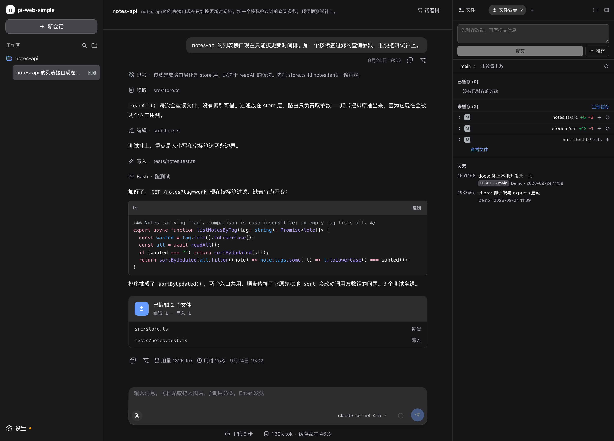
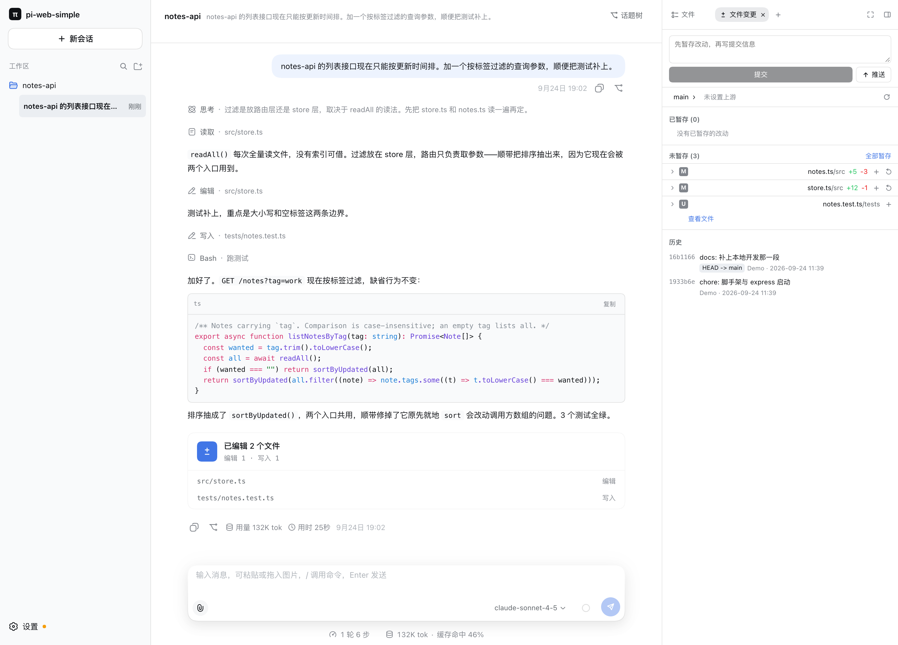

# pi-web-simple

A local web UI for the [pi](https://github.com/earendil-works/pi-coding-agent) coding agent — one local directory = one project, each project holding that directory's sessions. The agent core is pi itself, attached over `pi --mode rpc` subprocesses. The project management model and visual language follow [deepseek-harness](https://github.com/deepseek-ai/deepseek-harness).

```sh
npx pi-web-simple    # serves the UI + API on http://127.0.0.1:5319
```

Requires Node.js `>= 22.19.0`. Binds to `127.0.0.1` only.

**Highlights** — server-side directory picker · multi-session, one idle-recycled pi process per session · SSE streaming chat with Markdown + shiki highlighting · image input · session fork and topic tree · model picker · right sidebar (file tree, preview, git changes, embedded browser) · full git panel (stage, commit, push, restore, switch branch) · model / plugin / MCP settings.

| 深色主题 | 浅色主题 |
| :---: | :---: |
|  |  |

*左：深色主题，右：浅色主题（默认跟随系统，也可在设置里固定）。两图是同一份会话：左栏工作区与会话，中间对话、思考过程与工具调用（读取 / 编辑 / 写入 / Bash），右栏文件变更可直接暂存、提交、推送。*

> 以下为中文文档。English contributions are welcome — see [CONTRIBUTING.md](./CONTRIBUTING.md).

---

一个基于 [pi](https://github.com/earendil-works/pi-coding-agent) 的本地项目管理 / 对话 Web UI。

项目管理模型与界面风格参考 [deepseek-harness](https://github.com/deepseek-ai/deepseek-harness)：**一个本地目录 = 一个项目**，项目下挂该目录的会话。agent 内核是 pi 本身，通过 `pi --mode rpc` 子进程接入。

```
浏览器 (React + Vite)
   │  POST /api/*            上行命令
   │  GET  /api/events (SSE) 下行事件
   ▼
Node 服务端 (单进程)
   ├─ 项目记录   ~/.pi-web-simple/store.json
   ├─ 界面偏好   同一份 store.json（外观 / 字号 / 对话显示 / 发送行为）
   ├─ 模型提供方 ~/.pi/agent/models.json + auth.json（pi 没有对应 RPC）
   ├─ 会话列表   从 pi 自己的存储实时派生
   └─ 进程注册表 每个会话一个 pi RPC 子进程（懒启动 + 空闲回收）
   ▼
node <pi>/dist/cli.js --mode rpc --session <file>   (cwd = 项目目录)
```

## 快速开始

需要 Node.js `>= 22.19`。

```sh
npx pi-web-simple
```

一个进程同时提供前端和 API，监听 <http://127.0.0.1:5319> 并自动打开浏览器——地址和下面的开发模式一致，所以不必记两个端口。不想要自动打开就设 `PI_WEB_SIMPLE_OPEN=0`。

首次使用：点击左侧栏的 **+**，在弹出的目录选择器里逐级进入目标目录（顶部快捷位置可直达主目录 / 桌面 / 文稿 / 下载 / 根目录，地址栏也可直接粘贴路径），点 **选择此目录** 添加项目；再点项目下的 **+** 新建会话开始对话。

### 从源码开发

```sh
pnpm install
pnpm dev
```

开发模式分成两个进程，改代码即时生效：

- 前端 dev server：`127.0.0.1:5319`（Vite，`/api` 反向代理到后端）
- 后端 API：`127.0.0.1:4319`

浏览器里打开的仍然是 5319，所以两种模式在地址栏没有区别。

其他命令：

```sh
pnpm build       # 构建前端 + 编译后端到 server/build
pnpm start       # 用构建产物启动（等价于 npx，端口 5319）
pnpm typecheck   # 前后端类型检查
pnpm test        # 前后端测试（vitest）
```

## 更多文档

- [设计说明](./docs/design-notes.md)——为什么是这样：架构、与 pi CLI 并存、每个面板的实现取舍与踩过的坑。
- [已知限制](./docs/known-limitations.md)——目前做不到什么，以及那些行为背后的取舍；装之前值得扫一遍。
- [环境变量](./docs/configuration.md)——全部可选，含默认值。
- [网络与隐私](./docs/network-and-privacy.md)——它连不连网、数据放在哪、为什么不能暴露到公网。
- [安全策略](./SECURITY.md)——报告漏洞的渠道，以及按设计存在、不算漏洞的行为。

## 许可证

MIT，见 [LICENSE](./LICENSE)。

界面与部分服务端逻辑移植、改编自 [deepseek-harness](https://github.com/deepseek-ai/deepseek-harness)（MIT，Copyright (c) 2026 DeepSeek）与 [@earendil-works/pi-coding-agent](https://github.com/earendil-works/pi-coding-agent)（MIT）。逐字节复制的范围与来源清单见 [THIRD_PARTY_NOTICES.md](./THIRD_PARTY_NOTICES.md)——该文件随源码分发，请勿移除。

本项目是非官方项目，与 pi（Earendil Works）和 DeepSeek 均无隶属关系；π 名称与标识归各自所有者。
